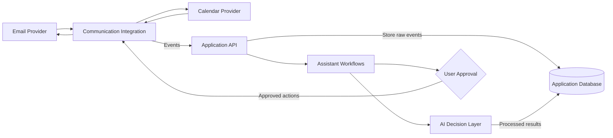

# AI Personal Assistant

## Introduction

AI Personal Assistant is an educational project for building an assistant that helps people manage email and calendar work.

The assistant receives events from connected communication services, converts provider-specific data into consistent application models, and routes each event through the appropriate workflow. AI components can then classify requests, extract useful information, and suggest next steps. The user remains in control of consequential actions such as sending messages or changing calendar events.

## What We Are Building

The completed application should be able to:

- connect to supported email and calendar providers
- receive new events without continuously polling external services
- normalize provider data into stable application schemas
- classify messages and route them to specialized workflows
- store raw events and processed results for traceability
- draft or perform actions after the required user approval
- expose health, event, and assistant functionality through an API

## High-Level Architecture



## How Data Moves Through the Application

1. A connected provider reports a new email or calendar event.
2. The application verifies and stores the incoming event.
3. A canonical schema separates the application from provider-specific payloads.
4. The workflow layer decides which assistant capability should handle the event.
5. The AI layer analyzes content and proposes the next action.
6. Actions requiring confirmation wait for the user before execution.
7. The application records the result for history and traceability.

## Intended Project Structure

The codebase will grow into this structure as each capability is implemented:

```text
ai-personal-assistant/
├── app/
│   ├── main.py                 # Application entry point
│   ├── api/                    # HTTP endpoints and incoming events
│   ├── integrations/           # Email and calendar provider clients
│   ├── schemas/                # Canonical application data models
│   ├── services/               # Email and calendar operations
│   ├── workflows/              # Event classification and routing
│   ├── agents/                 # AI decision-making logic
│   └── database/               # Persistence models and queries
├── tests/                      # Automated application checks
├── .env.example               # Required configuration names
└── pyproject.toml              # Python project configuration
```

Folders are added only when working code needs them. The diagram describes the intended destination rather than empty scaffolding that must exist from the beginning.

## Design Principles

- Keep provider-specific logic behind the integration boundary.
- Validate external events before processing them.
- Use canonical schemas throughout internal workflows.
- Separate API handling, workflows, AI decisions, and persistence.
- Require confirmation before consequential external actions.
- Never commit credentials or personal email content.
- Build and test one useful capability at a time.

## Technology Direction

The project uses Python as its foundation. As the application develops, it will introduce an API framework, typed data models, external-service integrations, AI workflows, persistent storage, containers, and cloud deployment.

Specific technologies may change as the project evolves. The architecture keeps those implementation choices separate from the assistant's core responsibilities.
